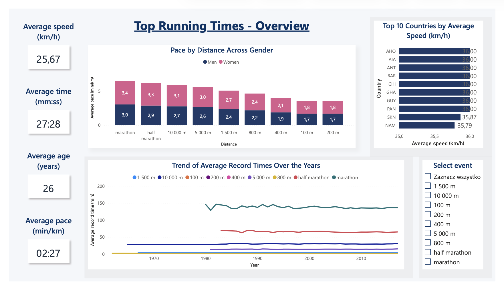
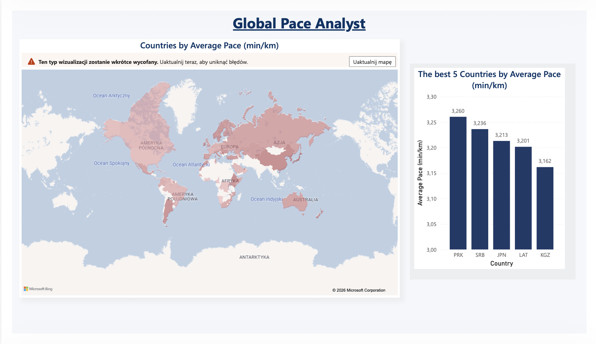
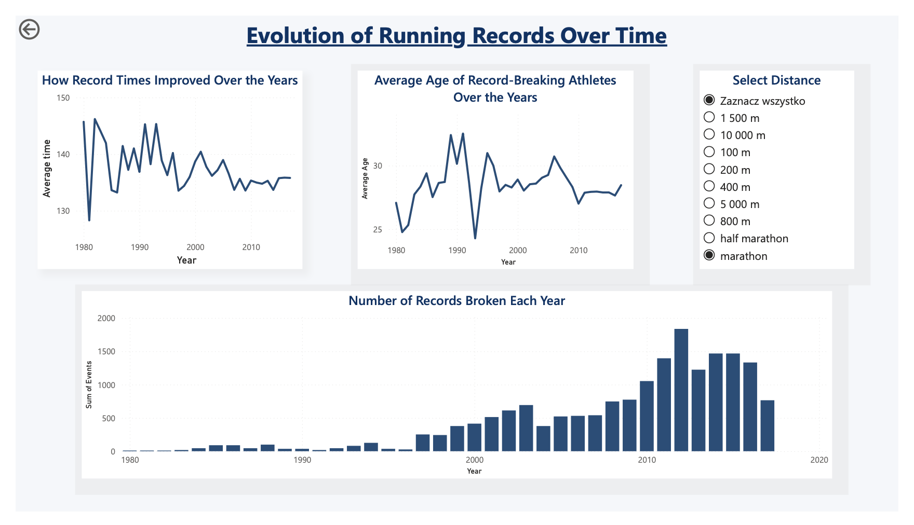

# Running Analysis Dashboard – Power BI

## Project Overview
This project presents an interactive Power BI dashboard created to analyze historical running records and performance trends across different running distances, countries and athlete groups.

The dashboard was built using a dataset from Kaggle:
https://www.kaggle.com/datasets/jguerreiro/running

The main goal of the project was to explore running performance data, identify trends over time and present key insights in a clear, interactive and business-friendly format.

## Dataset

The dataset contains information about running records, including selected running events, record times, athletes, countries, gender, age and year of performance.

Data source: Kaggle – Running dataset
https://www.kaggle.com/datasets/jguerreiro/running

## Tools Used

* Power BI
* Power Query
* Data visualization
* Data analysis
* Dashboard design

## Dashboard Pages

### 1. Top Running Times – Overview

The first page provides a general overview of running performance data. It includes key indicators such as:

* average speed,
* average time,
* average age,
* average pace,
* pace comparison by distance and gender,
* top countries by average speed,
* trend of average record times over the years.

This page was designed as a summary view that allows the user to quickly understand the main characteristics of the dataset.

### 2. Global Pace Analyst

The second page focuses on geographical analysis of running pace. It includes:

* map visualization of countries by average pace,
* ranking of the best countries by average pace,
* comparison of selected countries based on performance indicators.

This view helps identify geographical differences in running performance and compare countries in a visual way.

### 3. Evolution of Running Records Over Time

The third page analyzes how running records changed over time. It includes:

* changes in average record times over the years,
* average age of record-breaking athletes over the years,
* number of records broken each year,
* distance filtering for deeper analysis.

This page was created to show long-term trends and patterns in running records.

## Key Features

* Interactive report pages
* Filters by running distance/event
* Comparison of results by gender
* Country-level performance analysis
* Time-based trend analysis
* Clear KPI cards and visual summaries
* Business-style dashboard layout

## Scope of Work

As part of the project, I completed the following tasks:

* imported the dataset into Power BI,
* prepared and cleaned the data,
* created calculated measures and visual indicators,
* designed interactive dashboard pages,
* built charts, cards, filters and map visualizations,
* analyzed running performance by distance, gender, country and year,
* prepared a final report in Power BI and exported it to PDF.

## Files in This Repository

- `Running_Analysis.pbix` – Power BI project file
- `Running_Analysis.pdf` – exported dashboard preview
- `README.md` – project description
- `overview.png` – screenshot of the overview page
- `global_pace_analyst.png` – screenshot of the geographical analysis page
- `evolution_of_records.png` – screenshot of the time trend analysis page

## Dashboard Preview

## What I Learned

During this project, I developed my skills in Power BI, data visualization and dashboard design. I practiced preparing data for analysis, creating visual reports and presenting insights in a clear way. The project also helped me better understand how data can be used to compare performance, monitor trends and support data-driven conclusions.
